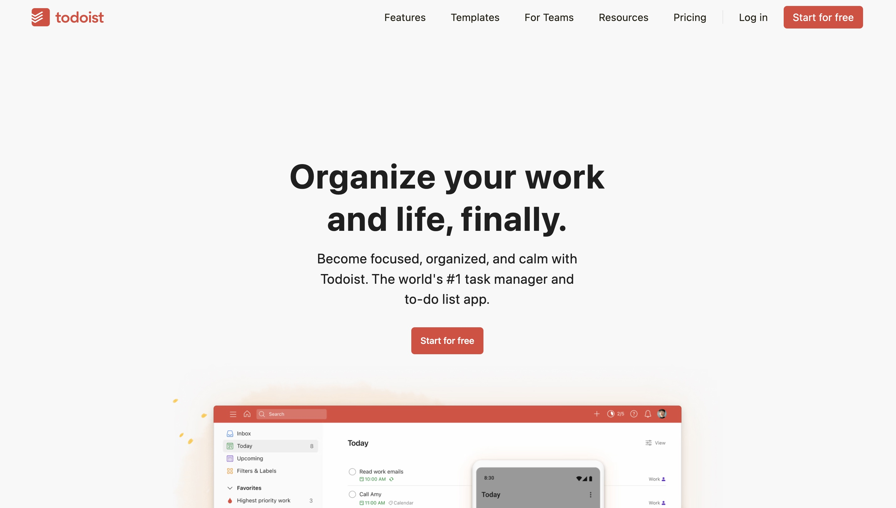
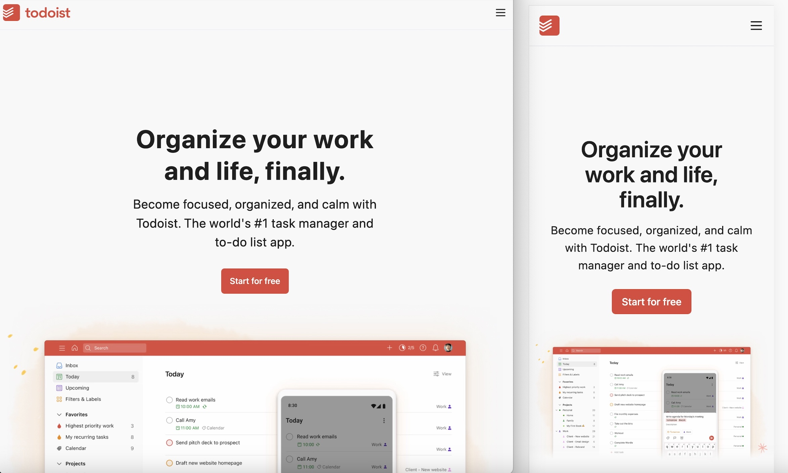

### An over-engineered to-do list app

 For this project, I aim to create a complete working example of a production-ready full-stack application. The app is a basic to-do list CRUD application that should have the following features:

 - Allow users to register and log in
 - Authenticated users can add, complete, uncomplete, modify, and delete tasks
 - Users can drag tasks to rearrange them
 - Users can add due dates to tasks
 - Users can schedule email reminders
 - Users can choose the priority for each task
 - Users can break tasks into subtasks
 - Users can set up projects with multiple tasks
 - Users can invite multiple team members to projects
 - Multiple team members can have discussion in task's comments
 - Projects can be shareable
 - Allow integration to other project management tools

 To prioritize functionality of the app, I am replicating Todoist's user interface instead of creating my own custom design. I really like their sleek aesthetic and the idea of creating/styling a Todoist UI clone has been in my plans for a while. 

##### Tech stack

`Frontend` : React + Vite, TypeScript, TailwindCSS

`Backend` : Node, Express

`Database`: MySQL, PlanetScale

`Testing`: Vitest

`Deployment`: Docker, AWS

#####  Progress

Desktop Screens

Tablet, Mobile Screens

